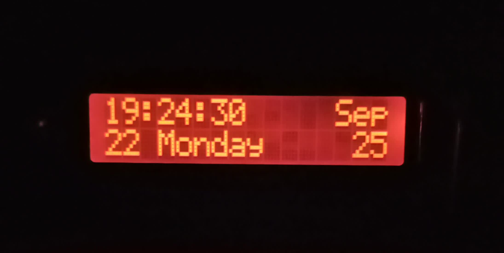

# Simple Clock - AVR Weather Station

A comprehensive AVR-based weather station and digital clock project featuring real-time clock, environmental sensors, and an intelligent display system with advanced alarm functionality and power management.

## 📋 Table of Contents

- [Overview](#overview)
- [Features](#features)
- [Hardware Requirements](#hardware-requirements)
- [Pin Configuration](#pin-configuration)
- [Installation](#installation)
- [Usage](#usage)
- [Project Structure](#project-structure)
- [API Documentation](#api-documentation)
- [Configuration](#configuration)
- [Troubleshooting](#troubleshooting)
- [Contributing](#contributing)
- [License](#license)

## 🌟 Overview

This project implements a sophisticated weather station and digital clock using an AVR microcontroller (ATmega328P). The system combines multiple sensors to provide real-time environmental data, precise timekeeping, and intelligent display management with automatic brightness control, advanced alarm functionality, and power management features.

## ✨ Features

### Core Functionality
- **Real-time Clock**: DS3231 RTC module with battery backup
- **Environmental Monitoring**: 
  - Temperature and humidity (DHT22)
  - Barometric pressure (BMP180)
  - Internal temperature from DS3231
- **Triple Display Modes**:
  - Large digital time display (30 seconds)
  - Calendar and date information (15 seconds)
  - Weather sensor data (15 seconds)
- **Advanced Alarm System**: Multi-stage alarm with progressive escalation
- **Intelligent Brightness Control**: Time-based LCD backlight management
- **Interactive Controls**: Button-based mode switching
- **Power Management**: Watchdog timer and sleep capabilities

### Advanced Features
- **Custom LCD Characters**: Large digit display using custom character sets
- **I2C Communication**: Efficient sensor communication protocol
- **Interrupt-driven Architecture**: Timer-based updates and button handling
- **PWM Backlight Control**: Smooth brightness transitions
- **Musical Alarms**: Multiple ringtone patterns for different alarm stages
- **Smart Sensor Reading**: Optimized sensor polling (every 30 seconds, disabled at night)

## 🆕 Recent Updates

### Version 2.0 Features
- **Triple Display System**: Enhanced from dual to triple display modes with optimized timing
- **Advanced Alarm System**: Multi-stage progressive alarm with weekend mode
- **Power Management**: Watchdog timer implementation for system reliability
- **PlatformIO Support**: Modern build system integration alongside traditional Make
- **Optimized Sensor Reading**: Smart polling strategy to reduce power consumption
- **Enhanced Brightness Control**: More granular time-based brightness management
- **Improved Display Content**: Better organized weather information display

### Key Improvements
- **Reliability**: Watchdog timer prevents system hangs
- **Efficiency**: Reduced sensor polling during night hours
- **User Experience**: Better display mode organization and timing
- **Maintainability**: PlatformIO integration for easier development

## 🔧 Hardware Requirements

### Microcontroller
- **ATmega328P** (Arduino Uno compatible)
- **Clock Speed**: 8MHz (configurable)
- **Memory**: 32KB Flash, 2KB SRAM

### Sensors and Modules
- **DS3231 RTC Module**: Real-time clock with temperature sensor
- **DHT22**: Digital temperature and humidity sensor
- **BMP180**: Barometric pressure sensor
- **LCD1602 with I2C Backpack**: 16x2 character display
- **Buzzer**: Piezo buzzer for alarm sounds
- **Photoresistor**: Ambient light sensing (optional, currently disabled)
- **Push Button**: Mode switching control

### Power Requirements
- **Operating Voltage**: 5V DC
- **Current Consumption**: ~100-200mA (depending on display brightness)
- **Backup Power**: CR2032 battery for RTC (included in DS3231 module)

## 📌 Pin Configuration

| Component | Pin | Function |
|-----------|-----|----------|
| **I2C Bus** | | |
| SDA | A4 (PC4) | I2C Data Line |
| SCL | A5 (PC5) | I2C Clock Line |
| **DHT22** | | |
| Data | PD5 | Digital I/O |
| **Buzzer** | | |
| Signal | PB0 | PWM Output |
| **LCD Backlight** | | |
| PWM | PD3 | PWM Control |
| **Button** | | |
| Mode Switch | PD2 | Digital Input (with pull-up) |
| **Photoresistor** | | |
| Analog | A2 (PC2) | ADC Input (optional) |

## 🚀 Installation

### Prerequisites
- **AVR-GCC Toolchain**: Version 3.4 or later
- **AVRDUDE**: For programming the microcontroller
- **Make**: Build system
- **Git**: Version control

### Building the Project

1. **Clone the repository**:
   ```bash
   git clone <repository-url>
   cd simple-clock
   ```

2. **Install PlatformIO** (if not already installed):
   ```bash
   pip install platformio
   ```

3. **Build the project**:
   ```bash
   pio run
   ```

4. **Upload to microcontroller**:
   ```bash
   pio run --target upload
   ```

5. **Alternative: Using Make** (if preferred):
   ```bash
   make clean
   make all
   make upload
   ```

### Hardware Assembly

1. **Connect I2C devices**:
   - DS3231: VCC→5V, GND→GND, SDA→A4, SCL→A5
   - LCD1602: VCC→5V, GND→GND, SDA→A4, SCL→A5 (I2C address: 0x27)

2. **Connect sensors**:
   - DHT22: VCC→5V, GND→GND, Data→PD5
   - BMP180: VCC→3.3V, GND→GND, SDA→A4, SCL→A5

3. **Connect peripherals**:
   - Buzzer: Positive→PB0, Negative→GND
   - Button: One terminal→PD2, Other terminal→GND
   - LCD Backlight: PWM control→PD3

## 📖 Usage

### Initial Setup

1. **Power on the system** - The device will display "Hello World" and perform a countdown
2. **Set initial time and date** (uncomment in main.c):
   ```c
   DS3231_setDate(31, 8, 25);  // Day, Month, Year
   DS3231_setTime(10, 52, 0);  // Hour, Minute, Second
   ```

3. **Configure alarm** (optional):
   ```c
   DS3231_setAlarm2(7, 0);  // 7:00 AM alarm
   ```

### Display Modes

The system automatically cycles between three display modes:

#### Mode 0: Large Time Display (30 seconds)
- Shows large, easy-to-read time format using custom characters
- Displays current time in HH:MM:SS format
- Optimized for distance viewing
- Only mode active during night hours (0:00-6:00)

#### Mode 1: Calendar Display (15 seconds)
- **Line 1**: Time (HH:MM:SS) and Month abbreviation
- **Line 2**: Day of month, Full day name, Year
- Shows complete date and time information

#### Mode 2: Weather Information (15 seconds)
- **Line 1**: BMP180 temperature, DHT22 temperature, DS3231 temperature
- **Line 2**: DHT22 humidity, BMP180 pressure (mmHg)
- Only displays during daylight hours (6:00-23:00)
- Sensors read every 30 seconds

### Alarm System

The alarm system features progressive escalation with multiple stages:

1. **Initial Alarm** (at set time): Beep every 15 seconds
2. **+1 minute**: Beep every 10 seconds  
3. **+5 minutes**: Ringtone every 20 seconds
4. **+10 minutes**: Alarm beep every 20 seconds
5. **+11 minutes**: Alarm beep every 15 seconds

**Note**: Alarm is disabled on Saturdays (weekend mode)

### Brightness Control

Automatic brightness adjustment based on time:
- **Night (23:00-06:00)**: Display off (0% brightness)
- **Evening (21:00-23:00)**: Dim (64% brightness)
- **Morning (06:00-07:00)**: Dim (64% brightness)
- **Day (07:00-21:00)**: Full brightness (96%)

## 📁 Project Structure

```
simple-clock/
├── src/                    # Source code files
│   ├── main.c             # Main application logic
│   ├── ds3231.c           # RTC module driver
│   ├── lcd1602.c          # LCD display driver
│   ├── dht22.c            # Temperature/humidity sensor
│   ├── bmp180.c           # Pressure sensor driver
│   ├── i2c.c              # I2C communication
│   ├── pwm.c              # PWM control
│   ├── adc.c              # Analog-to-digital conversion
│   ├── buzzer.c           # Audio output
│   └── uart.c             # Serial communication
├── include/               # Header files
│   ├── ds3231.h
│   ├── lcd1602.h
│   ├── dht22.h
│   ├── bmp180.h
│   ├── i2c.h
│   ├── pwm.h
│   ├── adc.h
│   ├── buzzer.h
│   └── uart.h
├── datasheet/             # Component datasheets
├── schemes/               # Circuit diagrams
├── lib/                   # External libraries
├── test/                  # Test files
└── README.md              # This file
```

## 📚 API Documentation

### DS3231 RTC Module
```c
void DS3231_init(void);
void DS3231_getTime(uint8_t* hour, uint8_t* minute, uint8_t* second);
void DS3231_setTime(uint8_t hour, uint8_t minute, uint8_t second);
void DS3231_getDate(uint8_t* day, uint8_t* month, uint8_t* year);
void DS3231_setDate(uint8_t day, uint8_t month, uint8_t year);
void DS3231_setAlarm2(uint8_t hour, uint8_t minute);
void DS3231_getTemperature(int8_t* temperature);
```

### LCD Display
```c
void lcd_init(void);
void lcd_clear(void);
void lcd_set_cursor(char row, char col);
void lcd_print(const char *str);
void display_large_time2(uint8_t hours, uint8_t minutes, uint8_t seconds);
void create_custom_chars(void);
```

### DHT22 Sensor
```c
void DHT22_Read(uint8_t* humidity_int, uint8_t* humidity_dec, 
                uint8_t* temperature_int, uint8_t* temperature_dec);
```

### BMP180 Sensor
```c
void BMP180_init(void);
float BMP180_readTemperature(void);
float BMP180_readPressure(void);
```

### Buzzer Control
```c
void initTimer2(void);
void playBeep(void);
void playAlarmBeep(void);
void playRingtone2(void);
void playNote(uint16_t frequency, uint16_t duration);
void playMorningScale(void);
void playBugleCall(void);
void playCheerfulWake(void);
void playChimePattern(void);
```

### Power Management
```c
void init_watchdog(void);
void wdt_reset(void);
```

### PWM Control
```c
void pwm_init(int8_t pin);
void pwm_set_duty_cycle(uint8_t duty_cycle);
```

## ⚙️ Configuration

### Clock Frequency
```c
#define F_CPU 8000000UL  // 8MHz operation
```

### Timer Configuration
```c
#define PRESCALER 1024
#define TARGET_FREQ 1    // 1Hz interrupt
```

### I2C Settings
```c
#define SCL_CLOCK 100000L  // 100kHz I2C clock
```

### Display Timing
```c
// Display mode switching (in main loop)
// 0 → for 0–29 seconds (30 seconds)
// 1 → for 30–44 seconds (15 seconds)  
// 2 → for 45–59 seconds (15 seconds)
current_display_mode = (time_second % 60 < 30) ? 0 : ((time_second % 60 < 45) ? 1 : 2);
```

### Power Management
```c
// Watchdog timer configuration
wdt_enable(WDTO_8S);  // 8-second timeout
WDTCSR |= (1 << WDIE);  // Enable watchdog interrupt
```

## 🔧 Troubleshooting

### Common Issues

1. **LCD Not Displaying**:
   - Check I2C connections (SDA→A4, SCL→A5)
   - Verify I2C address (should be 0x27)
   - Ensure proper power supply (5V)

2. **Time Not Updating**:
   - Check DS3231 connections
   - Verify battery in RTC module
   - Ensure proper I2C communication

3. **Sensors Not Reading**:
   - Check individual sensor connections
   - Verify power supply for each sensor
   - Test I2C bus with scanner

4. **Alarm Not Working**:
   - Verify buzzer connection (PB0)
   - Check alarm time setting
   - Ensure Timer2 is properly initialized

5. **Display Too Dim/Bright**:
   - Check PWM backlight control (PD3)
   - Verify time-based brightness logic
   - Test manual brightness adjustment

### Debug Features

Enable UART debugging by uncommenting UART-related code in main.c:
```c
//#include "uart.h"  // Uncomment for debugging
//uart_init(UART_BAUD_SELECT(UART_BAUD_RATE, F_CPU));
```

### Power Management Issues

1. **System Hanging**: 
   - Check watchdog timer configuration
   - Verify `wdt_reset()` calls in main loop
   - Ensure proper interrupt handling

2. **Display Not Updating**:
   - Check Timer1 configuration and interrupts
   - Verify `update_flag` is being set properly
   - Ensure global interrupts are enabled (`sei()`)

## 🤝 Contributing

1. Fork the repository
2. Create a feature branch (`git checkout -b feature/amazing-feature`)
3. Commit your changes (`git commit -m 'Add amazing feature'`)
4. Push to the branch (`git push origin feature/amazing-feature`)
5. Open a Pull Request

### Development Guidelines

- Follow existing code style and naming conventions
- Add appropriate comments for complex functions
- Test changes on actual hardware
- Update documentation for new features
- Ensure backward compatibility

## 📄 License

This project is licensed under the MIT License - see the [LICENSE](LICENSE) file for details.

## 🙏 Acknowledgments

- **Sergey Denisov** - Original LCD library implementation
- **Andy Gock** - UART library foundation
- **Bosch Sensortec** - BMP180 sensor documentation
- **AVR Community** - Various sensor driver implementations
- **PlatformIO** - Modern embedded development platform

## 📞 Support

For questions, issues, or contributions:
- Create an issue in the repository
- Check existing documentation and troubleshooting guide
- Review component datasheets in the `datasheet/` directory

---

**Note**: This project is designed for educational and hobbyist purposes. Always follow proper electrical safety practices when working with electronic components.

---


